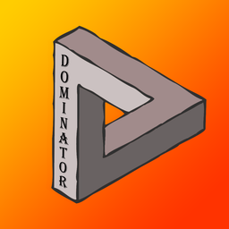

# ПРОЕКТ ЗАКРЫТ, ДАЛЬНЕЙШАЯ РАЗРАБОТКА НЕ ПЛАНИРУЕТСЯ!
# Dominator

<p align="center">
    
    <br>
	
	<br>
	
	
	
	<hr>
</p>

## О проекте
Бот для модерации и веселья в Discord.

## Функционал
- Возможности
    - Сменный префикс
    - Возможность удаления команд после исполнения
    - Выбор роли для мьюта
    - Автороль
    - Уведомления о новых участниках
    - Фильтрация чата
    - Отправка личных сообщений при наказаниях и их отмене
- Модерация
    - Кик (+причина)
    - Бан (+причина)
    - Разбан (по ID)
    - Мут
    - Размут
- Развлечения
    - Музыка (YouTube)
    

## Планы на будущее
- [x] ~~Добавить сменный префикс.~~
- [x] ~~Сделать функции модерации.~~
- [x] ~~Добавить функции для развлечения.~~
- [ ] ~~Сделать админку.~~

## Запуск
### Linux
```bash
# Клонируете репозиторий
git clone https://github.com/hilight3r/Dominator.git
cd Dominator
python3 -m pip install --upgrade pip
pip3 install -r requirements.txt
# Тут редактируете файл конфигурации config.py
nano config.py
python3 main.py
```
### Windows
```powershell
# Клонируете репозиторий
cd Dominator
python -m pip install --upgrade pip
pip install -r requirements.txt
# Тут редактируете файл конфикурации config.py
python main.py
```
